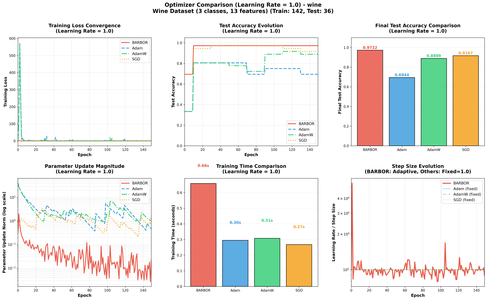
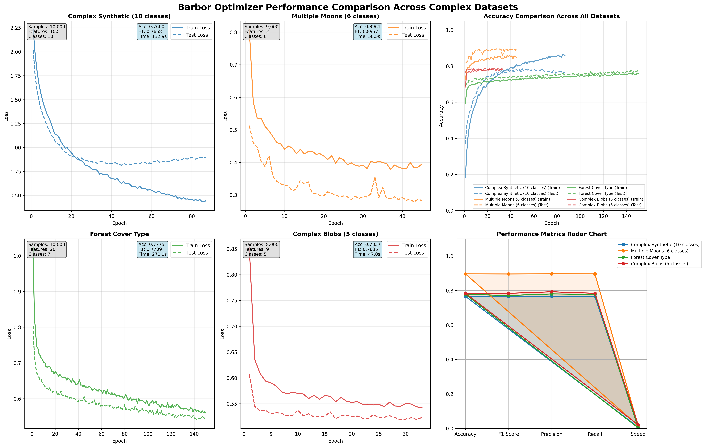

# barbor

The gradient optimization library with barzilar borwein method.

## comparison



## performance



## description

This PyTorch implementation of the Barzilai-Borwein (BB) gradient descent optimizer represents a sophisticated advancement beyond standard first-order optimization methods. The core innovation lies in its adaptive step size computation that approximates second-order curvature information without explicit Hessian calculation, addressing a fundamental limitation of fixed-learning-rate gradient descent.

The implementation introduces two complementary step size strategies: BB1 (α = s·s/s·y) and BB2 (α = s·y/y·y), where s represents parameter changes and y represents gradient differences between iterations. These formulas effectively capture local curvature, enabling the optimizer to automatically adjust step sizes based on problem geometry. The default alternating strategy intelligently switches between these variants, leveraging their complementary strengths—BB1 tends to be more stable while BB2 can achieve faster convergence.

A key innovation is the adaptive restart mechanism that prevents divergence in non-convex landscapes. The code implements three restart conditions: gradient orthogonality (when s and y become nearly orthogonal), negative gradient correlation (when consecutive gradients point in opposite directions), or a combined approach. This system allows the optimizer to reset to initial learning rates when progress stalls, effectively escaping regions of poor curvature.

The implementation also integrates momentum support (both standard and Nesterov variants) with the BB framework, creating a hybrid approach that combines momentum's acceleration with BB's curvature awareness. Comprehensive numerical safeguards—including regularization parameters, step size clamping, and division-by-zero protection—ensure robustness across diverse optimization landscapes.

Beyond the core algorithm, the optimizer provides extensive diagnostic tools for monitoring convergence behavior, including real-time step size tracking, gradient correlation metrics, and convergence statistics. This transparency allows users to understand the adaptive behavior and make informed adjustments.

The combination of curvature-aware step sizing, intelligent restart conditions, momentum integration, and robust numerical handling makes this implementation particularly valuable for non-convex optimization problems where traditional methods struggle with learning rate selection and convergence stability.

## install barbor

```python
pip install torch==2.1.0 --index-url https://download.pytorch.org/whl/cu121
pip install barbor
```